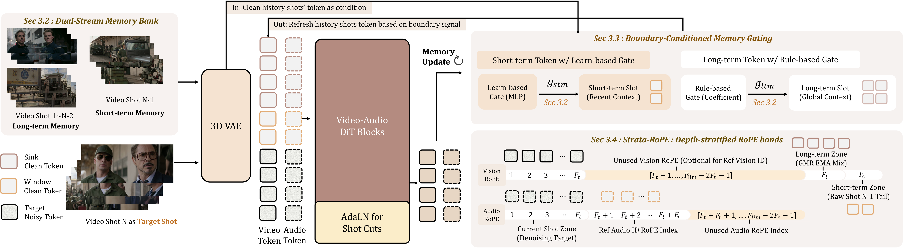
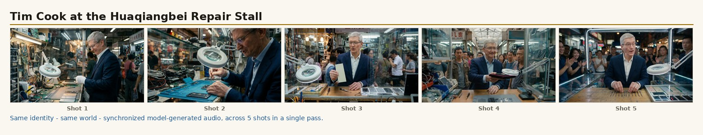
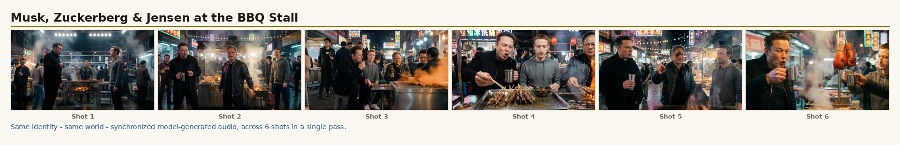
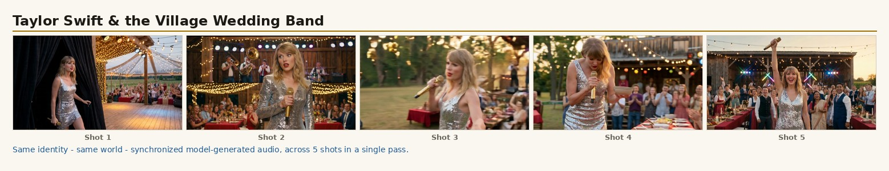
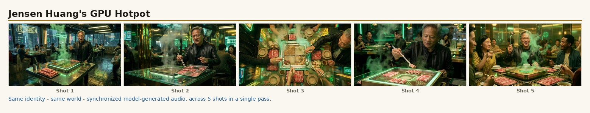
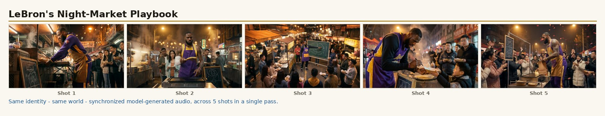
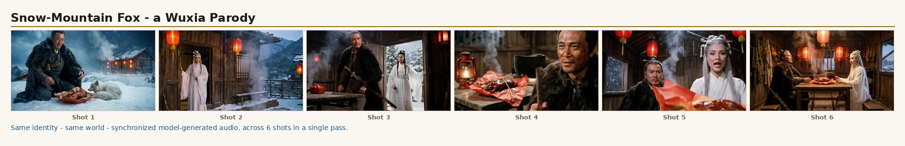

<div align="center">


# UnityShots : Memory-Driven Multi-Shot Audio-Video Generation with Boundary-Aware Gating

[](https://arxiv.org/abs/2606.21661)
[](https://jackailab.github.io/Projects/UnityShots/)
[](#%EF%B8%8F-license)
[](https://huggingface.co/datasets/KlingTeam/UnityShotsBench)
[](https://github.com/JIA-Lab-research/UnityShots/stargazers)

**[Jiehui Huang](https://github.com/)**<sup>1,&dagger;</sup> &middot;
[Yuechen Zhang](https://github.com/)<sup>2</sup> &middot;
[Bin Xia](https://github.com/)<sup>2</sup> &middot;
[Jiahao Wang](https://github.com/)<sup>3</sup> &middot;
[Xu He](https://github.com/)<sup>4</sup> &middot;
[Zhenchao Tang](https://github.com/)<sup>5</sup> &middot;<br>
[Meng Chu](https://github.com/)<sup>1</sup> &middot;
[Xin Tao](https://github.com/)<sup>3</sup> &middot;
[Pengfei Wan](https://github.com/)<sup>3</sup> &middot;
**[Jiaya Jia](https://jiaya.me/)**<sup>1,&#9993;</sup>

<sup>1</sup>HKUST &middot; <sup>2</sup>CUHK &middot; <sup>3</sup>**Kling Team, Kuaishou Technology** &middot; <sup>4</sup>Tsinghua University &middot; <sup>5</sup>Sun Yat-sen University

<sup>&dagger;</sup>Work done during internship at the Kling Team &nbsp;&middot;&nbsp; <sup>&#9993;</sup>Corresponding Author

---

### 📢 Checkpoints, training code & the agent system will be released soon — please stay tuned! ⭐

</div>

---

## 📢 News

- **[2026.06]** 🎉 Project page, arXiv paper, and the 200-case benchmark — [**🤗 KlingTeam/UnityShotsBench**](https://huggingface.co/datasets/KlingTeam/UnityShotsBench) — are live.

---

## 📖 Introduction

<div align="center">

<a href="https://jackailab.github.io/Projects/UnityShots/assets/intro.mp4" target="_blank" rel="noopener">
  
</a>

🔊 **Click the preview above to play the intro with audio (43s)** &nbsp;&middot;&nbsp; full gallery on the [Project Page](https://jackailab.github.io/Projects/UnityShots/)

</div>

**UnityShots** turns a single-shot audio-video diffusion model (**LTX-2.3 22B**) into a coherent
**multi-shot storyteller**. From one structured prompt it generates a **k-shot sequence (3–9 shots)** as a single continuous `.mp4` in which:

- 🎭 **Identity persists** — same face, wardrobe and body across cuts
- 🌍 **World persists** — scene, lighting and props stay consistent shot to shot
- 🔊 **Audio is generated and synchronized** — lip-synced speech + scene-aware ambient and score
- 🎬 **Cuts are controllable** — a learned cut-type prior becomes an inference-time knob

A single set of weights serves **three inference modes** — Text-to-Video (T2V), Image-to-Video (I2V), and Reference-to-Video (R2V) — via a per-shot mixed-mode **Shots-Forcing** training recipe.

---

## 🎯 Method

<div align="center">
  
</div>

Two fixed-size memory slots per modality — a **Long-Term Memory (LTM)** anchored to the opening shot
and a **Short-Term Memory (STM)** holding the immediately preceding tail — are fused at every cut by a
**Boundary-Aware Gate** conditioned on visual cut probability and beat signals. The audio stream injects
a reference speaker token at every shot to preserve vocal timbre without a growing audio bank. Memory
stays **constant-size**, so generation scales to long, many-shot stories.

---

## 📊 Results Gallery

High-resolution **1376×768** multi-shot generations. Each strip below shows one frame per shot of a single generated story — notice how the character and world stay consistent across every cut.

🔊 **Full videos with audio are on the [Project Page](https://jackailab.github.io/Projects/UnityShots/).**

<div align="center">








</div>

> Reference identities are public-domain or AI-generated and are shown for academic, non-commercial demonstration only.

---

## 🤗 Benchmark — released by the Kling Team

We release **UnityShotsBench** on the [**Kling Team** Hugging Face org](https://huggingface.co/KlingTeam) — a **200-case** multilingual, multi-cultural multi-shot storytelling benchmark spanning **13 languages** and **6 cultural regions**, with reference identity images, reference voice clips, and per-shot scripts for all three conditioning modes.

[](https://huggingface.co/datasets/KlingTeam/UnityShotsBench)

UnityShots reaches performance **comparable to strong open-source and closed-source baselines** including LTX-2, Ovi, MovA, IDLora and DreamID-Omni across cross-shot identity, audio coherence and visual aesthetics. Full numbers and qualitative comparisons are on the [project page](https://jackailab.github.io/Projects/UnityShots/) and in the [paper](https://arxiv.org/abs/2606.21661).

---

## 🗓️ Roadmap

We are gradually opening up the full UnityShots stack — **please stay tuned**:

- 🧠 **Model checkpoints** — T2V / I2V / R2V weights
- 🛠️ **Training code & recipes**
- 🤖 **Agent system** — turns a free-form idea into a structured multi-shot prompt for UnityShots

> ⭐ **If you find this work interesting, please star the repo** — it helps us prioritise the open-source release and reach more people. Thanks for your patience! 🙏

---

## ⚖️ License

Released under **CC BY-NC 4.0** (academic, non-commercial research only). Reference identities and generated media are provided for research and demonstration only.

---

## 📚 Citation

If you find this work useful for your research, please cite:

```bibtex
@article{huang2026unityshots,
  title   = {UnityShots: Memory-Driven Multi-Shot Audio-Video Generation with Boundary-Aware Gating},
  author  = {Huang, Jiehui and Zhang, Yuechen and Xia, Bin and Wang, Jiahao and
             He, Xu and Tang, Zhenchao and Chu, Meng and Tao, Xin and Wan, Pengfei and Jia, Jiaya},
  journal = {arXiv preprint arXiv:2606.21661},
  year    = {2026}
}
```

---

<div align="center">

### 🚀 Stay Tuned for Updates!

**Watch / Star** this repo to get notified when we release the checkpoints, training code, and agent system.

<sub>Fine-tuned from LTX-2.3 22B &middot; Work completed during an internship at the Kling Team, Kuaishou Technology.</sub>

</div>
